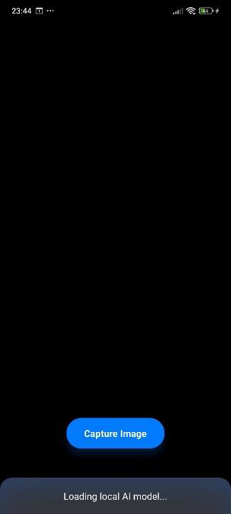
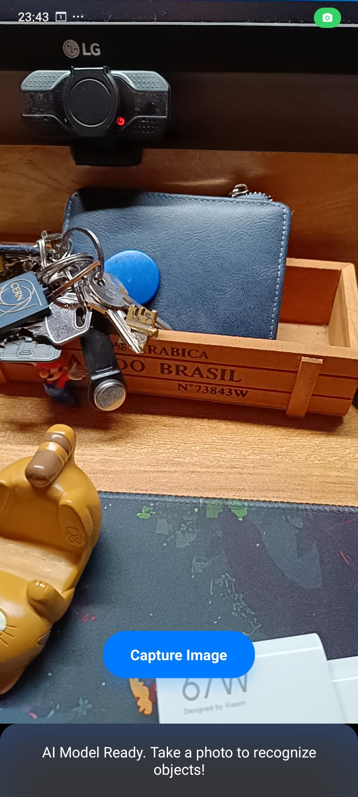
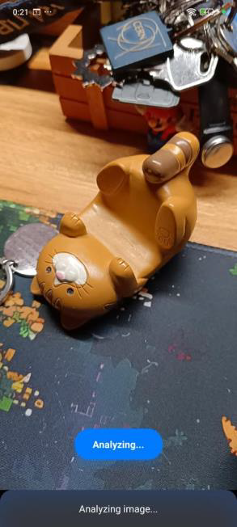
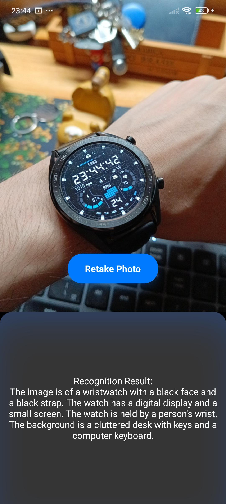

# AIDL A03 Assigment 3

## Student: Zelios Andreas mscaidl-0142

This is a repo for msc AIDL program of UNIWA, specifically for the part 2 of the A03 Module's project **“Development of an Object Recognition Application”**.

## Usage

<div align="center">

| 1. Model Loading | 2. Model Ready, take photo |
| :---: | :---: |
|  |  |

</div>

<br>

<div align="center">

| 3. Analyzing | 4. Result, Retake Photo |
| :---: | :---: |
|  |  |

</div>

## Process to implement

1. Create the basic react native application:

      ```bash
      npx create-expo-app ai-application
      ```
2. update npm to latest version, or install it if you don't have it:

      ```bash
      npm install -g npm@latest
      ```
   
   and [node](https://nodejs.org/en/blog/release/v22.15.1) also

3. install necessary packages

      To install we have to use cmd, bash has a problem in windows, run

      ```bash
      set "TAR_OPTIONS=--force-local" && npm install
      ```

      set "TAR_OPTIONS=--force-local", treats everything locally, by default it tries to fetch
      network paths for some reason

4. install the models that ollama will use, download from [here](https://huggingface.co/ggml-org/SmolVLM2-256M-Video-Instruct-GGUF/blob/main/SmolVLM2-256M-Video-Instruct-Q8_0.gguf) and [here](https://huggingface.co/ggml-org/SmolVLM2-256M-Video-Instruct-GGUF/blob/main/mmproj-SmolVLM2-256M-Video-Instruct-Q8_0.gguf).

5. configure metro to handle the new extensions .gguf, by default it ignores it, run:

      ```bash
      npx expo customize metro.config.js
      ```

      this will create a metro.config.js file, add the following lines to it:

      ```javascript
      const config = getDefaultConfig(__dirname);

      config.resolver.assetExts.push('gguf'); // this one

      module.exports = config;
      ```
6. add camera permission to app.js

      ```javascript
     "android": {
            "newArchEnabled": true,
            "permissions": [
            "android.permission.CAMERA" // this one
            ],
            "jsEngine": "hermes",
            "adaptiveIcon": {
            "backgroundColor": "#E6F4FE",
            "foregroundImage": "./assets/images/android-icon-foreground.png",
            "backgroundImage": "./assets/images/android-icon-background.png",
            "monochromeImage": "./assets/images/android-icon-monochrome.png"
            },
            "edgeToEdgeEnabled": true,
            "predictiveBackGestureEnabled": false,
            "package": "com.andreaszel.aiapplication"
      },
      ```


7. prebuild and build the project 

     ```bash
      npx expo prebuild --clean
      npx expo start --clear
     ```

8. create a debug build, we dpn't need a release, because we won't upload to play store. Please move
   ai-application to desktop before you create, there are issues with big path an c++ files 

   ```bash
   npx expo run:android --variant release
   ```

   then a apk will be created in android\app\build\outputs\apk\release\app-release.apk

   take it and istall it in your device